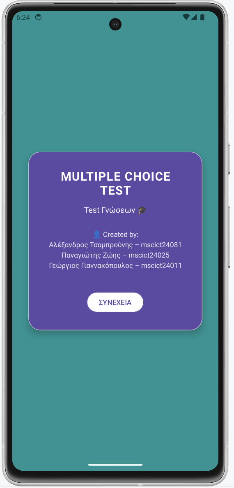

# Android Multiple Choice Test App

A native Android application developed in Java that implements a structured multiple-choice testing system with user interaction, navigation flow, and state management.

Developed as a team semester project (MSc ICT – University of West Attica).

---

## 📌 Overview

This application simulates a structured test environment where users:

- Log in
- Answer multiple-choice questions
- Navigate through questions
- View final results
- Track progress dynamically

The project focuses on Android fundamentals, UI interaction, activity lifecycle handling, and clean application flow.

---

## 🚀 Key Features

- Login screen
- Multiple-choice quiz interface
- Dynamic step indicator
- Back navigation handling
- Score calculation
- Result screen
- Controlled test flow logic
- Basic input validation

---

## 🧠 Technical Concepts Demonstrated

- Android Activity lifecycle
- Intents & Activity navigation
- View binding
- Layout design (XML)
- State management
- Dynamic UI updates
- Event handling (buttons, selections)
- Gradle project structure
- Git branching & merging

---

## 🏗 Project Structure

- `app/src/main/java/` → Java source code
- `app/src/main/res/layout/` → XML layouts
- `app/src/main/AndroidManifest.xml` → App configuration
- `build.gradle.kts` → Gradle build configuration

---

## 🛠 Tech Stack

- Java
- Android SDK
- Gradle (Kotlin DSL)
- XML Layouts

---

## 👥 Team & My Contribution

Team project developed with:

- Panagiotis Zois
- Alexandros Tsamprounis
- George Orestis Giannakopoulos

---

## My Contribution

- Designed and implemented the core application logic for quiz flow control.
- Structured activity navigation and managed screen transitions using Intents.
- Implemented dynamic UI updates (question navigation & step indicator).
- Handled user input validation and answer evaluation logic.
- Contributed to data handling and state management during quiz progression.
- Coordinated Git workflow (branching, merging, issue fixes).

---

## 🔮 Future Improvements

- SQLite integration
- Persistent score tracking
- Question randomization
- Improved UI/UX
- Timer functionality
- MVVM architecture refactor

---

## 📷 Screenshots

## 📷 Screenshots

### Login Screen

### Quiz Screen

### Results Screen

